# NumeracyCheck

I have built a desktop quiz that checks and records knowledge of prime numbers for consulting teams.
I built it in Python with Tkinter, it saves every attempt to a CSV file and is tested automatically every time I upload a change.


---

## Contents

1. [Introduction](#1-introduction)
2. [Design](#2-design)
3. [Development](#3-development)
4. [Testing](#4-testing)
5. [Documentation](#5-documentation)
6. [Evaluation](#6-evaluation)
7. [References](#references)

---

## 1. Introduction

I work in IBM Consulting in London as a degree apprentice. I am currently a test engineer on a public sector delivery. My daily work is writing test scripts and executing these scripts for a self-service portal, then reviewing it with business analysts and project managers.

The reason as to why I have created this project was because mathematical skills are constantly being used in my daily work. For example one of my daily tasks might include turning a defect count into a pass rate to see the percentage of issues that were resolved or I may have to do some statistical data analysis on testing data. Yet in my project team we are not tested on these skills, so any mistakes on deliverables may take place in front of the client, which could cause issues. The second is that the early professionals community runs numerical reasoning practice and this quiz relates to those tests.

This project I have created called NumeracyCheck addresses these issues. A user enters their name, picks a topic such as identifying primes or prime factors and then answers a short set of questions. This allows them to get a score straight away with an outcome band. Every attempt is added to a CSV file, which means that the team lead can open the file and review the scores each user has got.


---

## 2. Design

### 2.1 User journey

The application I have made has four screens and one loop. This means that it is impossible to reach the end of the quiz without completing every question.

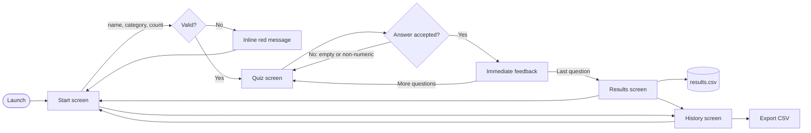

### 2.2 Interface design

I drew the screen designs in Figma before I began.

| Screen 1: Start | Screen 2: Quiz |
| --- | --- |
| 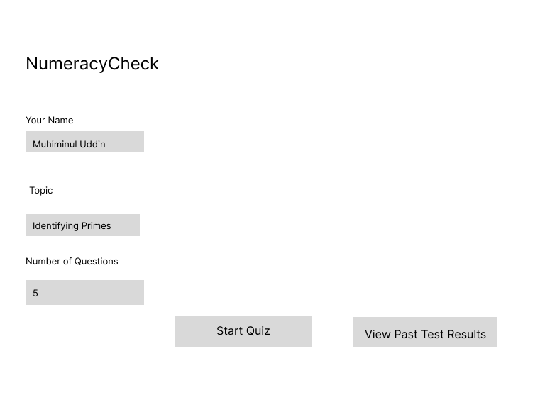 | 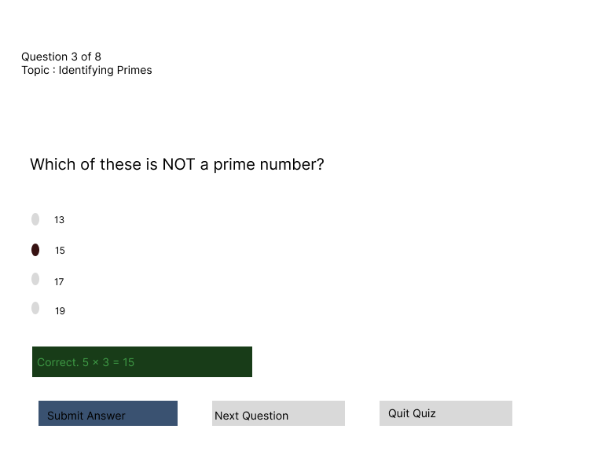 |
| The user can enter their name, choose a topic and select how many questions they want. | The quiz shows one question at a time, as well as the progress. Any feedback is shown underneath the answer, with an explanation of how to get the answer rather than just showing the correct answer. |

| Screen 3: Results | Screen 4: History |
| --- | --- |
| 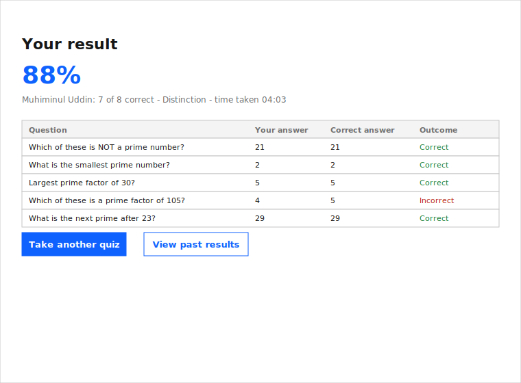 | 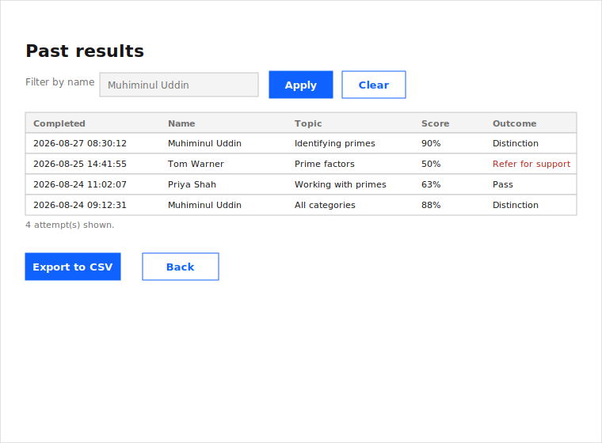 |
| The results show the user's score, overall result and a breakdown of each question this means they can see exactly where they went wrong. | Each quiz attempt is saved here and the results can be filtered by name. There is also an export button which only exports the results currently being shown. |

The finished screens closely match the initial screen designs I made on Figma.

| Start | Quiz |
| --- | --- |
| 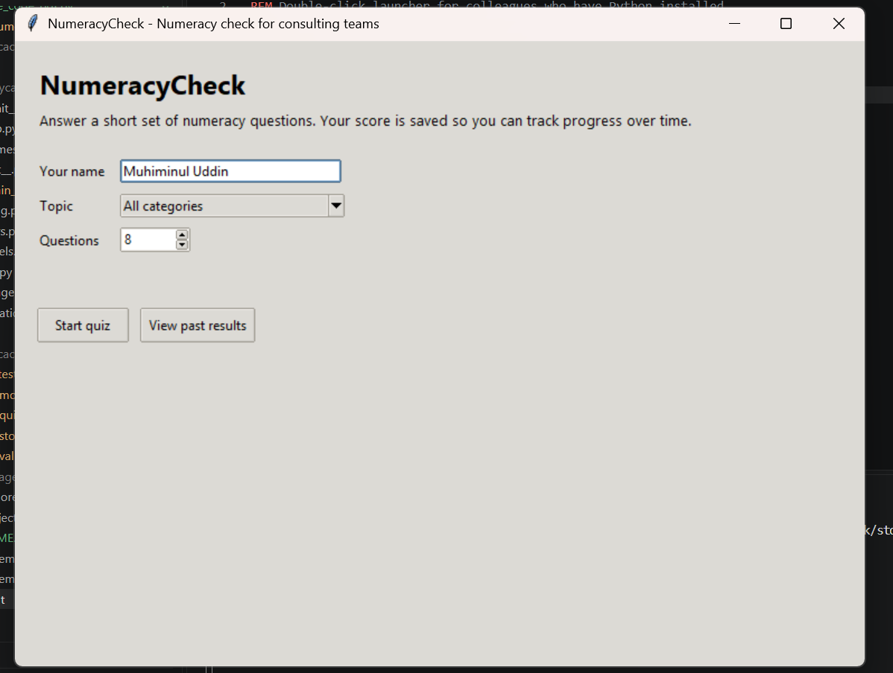 | 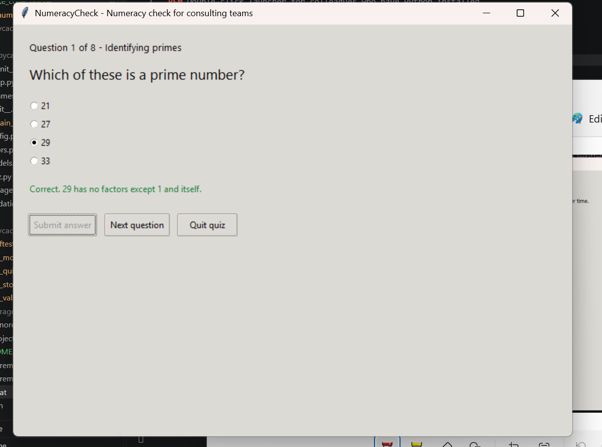 |

| Results | History |
| --- | --- |
| 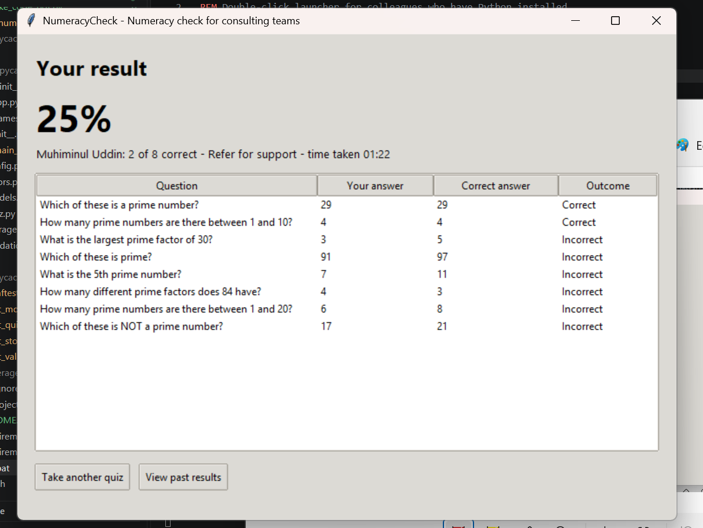 | 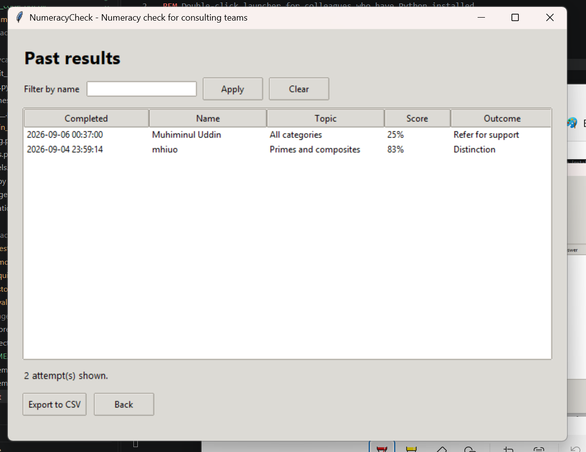 |

### 2.3 Functional requirements

| ID | Requirement | Priority | Met by |
| --- | --- | --- | --- |
| FR1 | A user can enter their name before starting a quiz | Must | `StartFrame` |
| FR2 | A user can choose a topic or all topics | Must | `QuestionBank.categories` |
| FR3 | A user can choose how many questions they want to answer, between 3 and 20 | Should | `config.MIN_QUESTIONS` / `MAX_QUESTIONS` |
| FR4 | Questions are drawn at random and never repeat within an attempt | Must | `QuestionBank.pick` |
| FR5 | The system can be both multiple-choice and typed numeric answers | Must | `MultipleChoiceQuestion`, `NumericQuestion` |
| FR6 | An answer is marked immediately and the correct answer is explained | Must | `Quiz.submit` |
| FR7 | A final score, percentage and outcome band are shown | Must | `ResultsFrame` |
| FR8 | Every completed attempt is uploaded to a storage file | Must | `ResultsStore.save` |
| FR9 | Past attempts can be viewed and filtered by candidate name | Should | `HistoryFrame`, `filter_by_name` |
| FR10 | Results can be exported to a CSV file chosen by the user | Should | `ResultsStore.export` |
| FR11 | The question bank is editable by a non-developer without needing to change the code | Should | `data/questions.csv` |
| FR12 | Invalid input is rejected with a message stating why rather than it being marked wrong | Must | `validation`, `Question.check` |

### 2.4 Non-functional requirements

| ID | Requirement | Target | How it is achieved |
| --- | --- | --- | --- |
| NFR1 | Portability | Runs on Windows, macOS and Linux without an installer | Uses only the Python Standard library. Tkinter is included with Python so no additional software is required |
| NFR2 | Reliability | A single invalid row should not cause the application to crash | Each row is validated as it is loaded. Invalid rows are skipped and reported without stopping the program |
| NFR3 | Performance | Process any screen change in under 200ms | Data is loaded into memory reducing repeated file access and keeping validation fast |
| NFR4 | Easy to change | Marking rules can be changed without touching the interface | Validation logic is kept separate from the GUI, so rules can be modified independently |
| NFR5 | Easy to test | Rules can be tested without opening the application window | Validation code is independent of the interface, allowing automated unit tests to run without launching the GUI |
| NFR6 | Data safety | Validation should not overwrite the original data | The original CSV file is left unchanged. Results are written to a separate output file. |
| NFR7 | Accessibility | The application should be usable with a keyboard and feedback should not only rely on colour  | Users can navigate with the keyboard and all feedback is displayed in clear text |

### 2.5 Tech stack

| Layer | Choice | Why |
| --- | --- | --- |
| Language | [Python 3.11+](https://docs.python.org/3/) | Required by the brief and already used across my team for automation purposes |
| Interface | [Tkinter](https://docs.python.org/3/library/tkinter.ttk.html) | Tkinter comes with Python and also was a good fit for me creating the desktop interface |
| Storage | [CSV](https://docs.python.org/3/library/csv.html) | Match the project requirements and is used to store data |
| Question and result classes | [`dataclasses`](https://docs.python.org/3/library/dataclasses.html), [`abc`](https://docs.python.org/3/library/abc.html) | Dataclasses make it easier to represent questions and validation results clearly. While abc was used to define a structure for different question types. |
| Testing | [pytest](https://docs.pytest.org/) with [pytest-cov](https://pytest-cov.readthedocs.io/) | Pytest was chosen because it makes writing and running unit tests simple making sure validation works as expected. |
| Style checking | [Ruff](https://docs.astral.sh/ruff/) | Was used to check for any issues and mistakes with codes and docstrings when I made them. |
| Automatic checks | [GitHub Actions](https://docs.github.com/en/actions) | Runs the tests every time I upload a change. |
| Packaging | [PyInstaller](https://pyinstaller.org/) | Pyinstaller means that the application can be run on another computer without Python needing to be installed. |

### 2.6 Code design

The project will have a structured design layering user interaction, application logic and data storage. By using layers this means my code will stay organised and be easy to develop as the project expands. This structure also allows me to create separate unit tests for the validation logic from the user interfaces, thus allowing me to test the validation logic separately of the GUI.

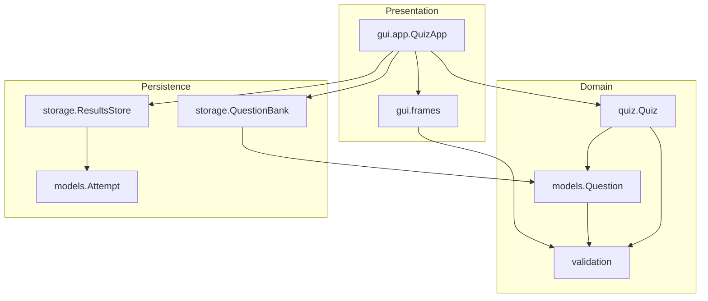

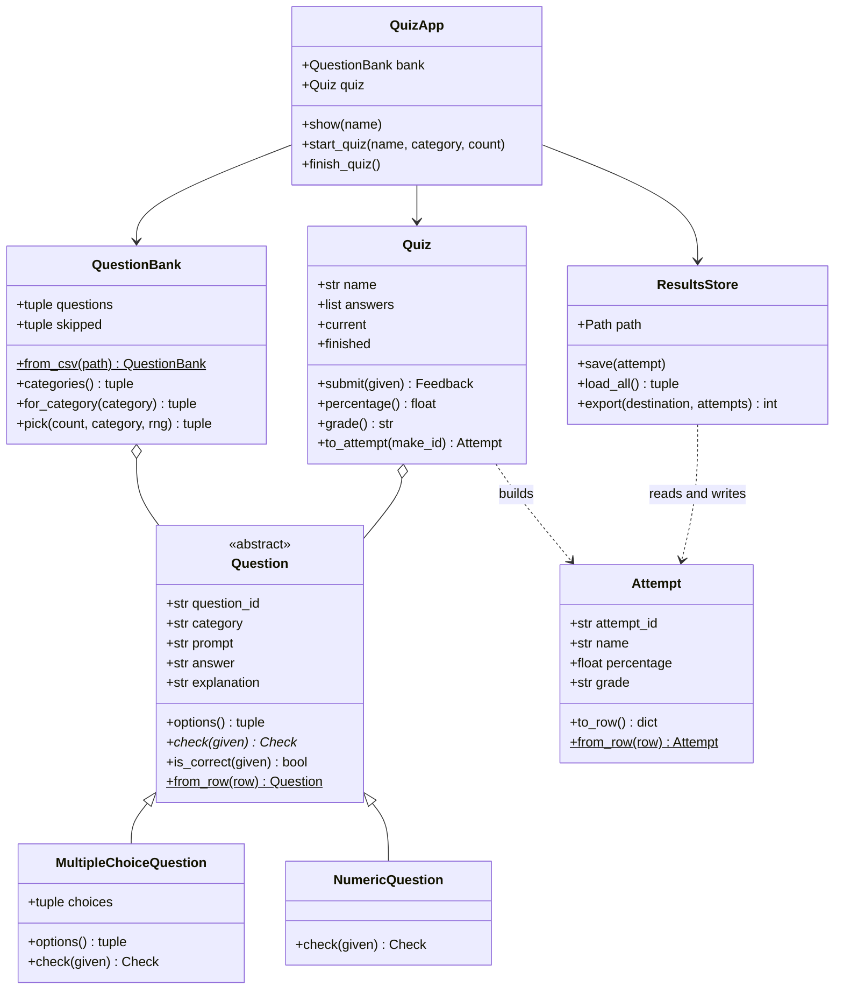

### 2.7 Repository structure

```text
numeracy-check/
├── .github/workflows/ci.yml       # runs the CI checks
├── run.bat / run.sh               # starts the scripts
├── data/
│   ├── questions.csv              # stores the questions
│   └── results.sample.csv         # example results
├── docs/
│   ├── images/                    # screenshots and screen designs
├── src/numeracycheck/
│   ├── validation.py              # checks user input
│   ├── models.py                  # contains the Questions and attempt class
│   ├── storage.py                 # handles saving data to CSV
│   ├── quiz.py                    # controls the quiz logic
│   ├── errors.py                  # custom error types
│   ├── config.py                  # stores the configuration settings
│   └── gui/                       # tkinter interface
├── tests/                         # automated tests
└── pyproject.toml                 # project configuration
```

---

## 3. Development

As I developed this application, I did so in stages. Firstly I developed all of my validation logic, then I created the classes for questions and results. Next, I implemented the CSV file support. Finally, I created the application's quiz logic and GUI. As I finished each part of the application I would run individual tests against it, ensuring each part of the application worked as expected before moving on to the next stage.

### 3.1 The rules, written as simple functions

The rules used to determine outcomes are stored in `validation.py.` They were written as simple functions which do not use external files or data, therefore their output depends solely upon the input they are given. These characteristics made it relatively easy to test the rules individually.

```python
def score_percentage(correct: int, total: int) -> float:
    """Convert a score into a percentage, rounded to one decimal place.

    Args:
        correct: Number of questions answered correctly.
        total: Total number of questions.

    Returns:
        float: The percentage or 0.0 if no questions were asked.

    Raises:
        ValueError: If the numbers are negative or the correct score is greater than the total.
    """
    if correct < 0 or total < 0:
        raise ValueError("Scores cannot be negative.")
    if correct > total:
        raise ValueError("Correct answers cannot exceed the number of questions.")
    return round(correct / total * 100, 1) if total else 0.0
```

I spent the most amount of time developing my marking functionality. While testing my application I discovered that there could be the possibly that users might enter their responses in various ways. Some examples included entering their response as `29.0` versus `29`, or some users had leading/trailing spaces around their numeric entries (i.e., `2 x 2 x 3 x 5`). As a result to solve this issue, I developed an additional method called `answers_match`. This method assists in making answers look identical prior to comparison. Additionally, for numbers, it accepts a very small degree of variation. Thus, if there is a slight difference in how the user enters their answer, it does not reject the answer and accepts it instead.

```python
def answers_match(given: object, correct: object) -> bool:
    """Decide whether an answer should be marked right."""
    given_number, correct_number = to_number(given), to_number(correct)
    if given_number is not None and correct_number is not None:
        return abs(given_number - correct_number) <= TOLERANCE
    given_text = clean_answer(given).replace(" ", "")
    return bool(given_text) and given_text == clean_answer(correct).replace(" ", "")
```

In addition to returning whether an answer passes/failed, each check returns a reason. Therefore, when displaying messages about why an answer either failed or succeeded the GUI could provide meaningful feedback to the user regarding why his/her response received a particular grade.

```python
class Check(NamedTuple):
    """The result of a check: whether it passed, and why not if it failed."""

    ok: bool
    message: str
```

### 3.2 Using classes for the two question types

Both types of questions are graded in the same manner, however both are checked differently. A Multiple Choice question may only select one option available. However, a typed answer question requires that the response provided is a number. Due to these differences in checking methods, I utilised `Question` as an `Abstract Base Class`. It outlines the common properties and behaviours applicable to all questions without specifying exactly how those should occur. Since both types are objects that are fixed this means that neither the screens nor the application logic can accidentally change a question while it is being run.

```python
@dataclass(frozen=True)
class Question(ABC):
    """A quiz question that once loaded it means it cannot be changed"""

    question_id: str
    category: str
    prompt: str
    answer: str
    explanation: str = ""

    @abstractmethod
    def check(self, given: object) -> validation.Check:
        """Check that an answer is usable and valid before it is marked."""

    def is_correct(self, given: object) -> bool:
        """Mark an answer against the stored one."""
        return validation.answers_match(given, self.answer)

    @classmethod
    def from_row(cls, row: dict) -> "Question":
        """Create the appropriate question type from a row in the CSV file."""
        result = validation.check_question_row(row)
        if not result.ok:
            raise DataError(result.message)
        ...
        if str(row["type"]).strip().lower() == "multiple_choice":
            return MultipleChoiceQuestion(choices=..., **fields)
        return NumericQuestion(**fields)
```

### 3.3 Persistent storage

The question bank is a spreadsheet, so anybody can add questions without needing to use Python

```csv
id,category,type,prompt,options,answer,explanation
Q01,Identifying primes,multiple_choice,Which of these is a prime number?,21|27|29|33,29,29 has no factors except 1 and itself.
Q14,Prime factors,numeric,What is the largest prime factor of 30?,,5,30 = 2 x 3 x 5.
Q24,Working with primes,numeric,What is the 5th prime number?,,11,The order is 2 3 5 7 11.
```

Because it can be edited it by anybody, every row is checked as it loads.

```python
for line, row in enumerate(reader, start=2):
    try:
        questions.append(Question.from_row(row))
    except DataError as error:
        message = f"Row {line} skipped: {error}"
        logger.warning(message)
        skipped.append(message)
```

`ResultsStore` is only responsible for reading and writing the results file, so any file related problems are translated into messages the user can act on.

```python
def save(self, attempt: Attempt) -> None:
    """Add one finished attempt to the end of the results file."""
    try:
        self.path.parent.mkdir(parents=True, exist_ok=True)
        exists = self.path.exists() and self.path.stat().st_size > 0
        with self.path.open("a", encoding="utf-8", newline="") as handle:
            writer = csv.DictWriter(handle, fieldnames=Attempt.COLUMNS)
            if not exists:
                writer.writeheader()
            writer.writerow(attempt.to_row())
    except PermissionError as error:
        raise DataError(
            f"Cannot write to {self.path}. Close the file in Excel and try again."
        ) from error
    except OSError as error:
        raise DataError(f"Could not save results: {error}") from error
```

### 3.4 The quiz session

`Quiz` keeps track of the attempt the user is doing. An answer that fails the checks means the quiz does not continue.

```python
def submit(self, given: object) -> Feedback:
    """Checks an answer. After it marks it then records it and moves on."""
    question = self.current
    check = question.check(given)
    if not check.ok:
        return Feedback(False, False, check.message)

    correct = question.is_correct(given)
    self.answers.append(Answered(question, str(given).strip(), correct))
    self.position += 1

    message = "Correct." if correct else f"Not quite. The answer is {question.answer}."
    if question.explanation:
        message = f"{message} {question.explanation}"
    return Feedback(True, correct, message)
```

 Providing the clock and the random number generator to the quiz really paid off, as previously I relied on their exactness in order to ensure my question picking and timing tests ran reliably. Now with this change I made, these tests will consistently produce the same result every time.

### 3.5 The interface

`QuizApp` inherits from `tk.Tk`. All my four screens have been made and the selected one is pushed to the front whenever the user navigates to it.

```python
for screen in (StartFrame, QuizFrame, ResultsFrame, HistoryFrame):
    frame = screen(container, self)
    self.frames[screen.__name__] = frame
    frame.grid(row=0, column=0, sticky="nsew")

def show(self, name: str) -> None:
    """Bring one screen to the front."""
    frame = self.frames[name]
    if hasattr(frame, "on_show"):
        frame.on_show()
    frame.tkraise()
```

The screens contain no logic or rules

```python
def start(self) -> None:
    """Check the form, then ask the app to start a quiz."""
    check = validation.validate_name(self.name_var.get())
    if not check.ok:
        self.error.config(text=check.message)
        return
    ...
    self.app.start_quiz(self.name_var.get(), self.topic_var.get(), count)
```

### 3.6 Automatic checks on every upload

Every code upload triggers all 31 tests on two versions of Python and it fails if the tests run less than 85 per cent of the code.

```yaml
strategy:
  matrix:
    python-version: ["3.11", "3.12"]
steps:
  - name: Lint with ruff
    run: ruff check .
  - name: Run unit tests with coverage
    run: pytest --cov --cov-report=term-missing --cov-fail-under=85
```

---

## 4. Testing

### 4.1 How I tested it, and why

I have conducted testing on three tiers.

| Type | Scope of coverage | Rationale for this approach | Tool |
| --- | --- | --- | --- |
| Unit testing | Rules, Question & Result classes, quiz | The rules for pass/fail determination have to be accurate all the time and are fast to test separately. A mistake in determining the correctness of an answer would undermine the tool | pytest |
| Tests with real files | Results saving & loading, loading of the questions file | If I had faked files, then the issue of repeating column headings and a wrong row which would ruin the history screen would not have been detected. pytest gives a temporary folder to each test, so no real data gets modified. | pytest |
| Manual testing | Screens, keyboard interactions, popups | Automation of the desktop application would require too much overhead for the scale we're at now, and it is a matter of human judgement whether the message makes sense or not. | Test scenarios |

These tests were done using **boundary value analysis**, the method I use at work, I look at the boundaries rather than a nice middle figure. According to the rule, if a grade is 80 percent or higher, then it is a distinction, therefore the test uses 79.9 and 80.0, and 59.9 and 60.0 for the passing boundary. Each field that the user can enter data into was also checked using bad inputs like blank, spaces, letters in number fields, too long a name, and command in a name.


There were two factors that allowed the tests to be quick and efficient. First, none of the tests opens any windows, which allows them to work on the GitHub machines and secondly, the time counter and the random number generator are submitted, which guarantees consistent results.

### 4.2 Manual test results

Run on Windows 11 with Python 3.13.9 on 03/09/2026 against the `main` branch, taking me about ten minutes.

| ID | Area | Steps | Expected result | Actual result | Status |
| --- | --- | --- | --- | --- | --- |
| MT01 | Start screen | Launch the app and press **Start quiz** without entering a name |  a red message which asks the user to enter your name before starting | As expected | Pass |
| MT02 | Start screen | Enter `ABC12345` and press **Start quiz** | Message about letters, spaces, hyphens and apostrophes only | As expected | Pass |
| MT03 | Start screen | Enter a valid name, leave category as **All categories** and press **Start quiz** | Quiz screen opens with the first question | As expected | Pass |
| MT04 | Start screen | Choose the topic **Prime factors** and 5 questions | Only prime factor questions are asked | As expected | Pass |
| MT05 | Start screen | Set the question count to 20 with **Working with primes** selected | A warning that only 5 questions are available in that topic | As expected | Pass |
| MT06 | Quiz screen | Press **Submit answer** on a multiple-choice question without selecting an option | A message asks the user to select an option before submitting | As expected | Pass |
| MT07 | Quiz screen | Type `abc` into a numeric question and submit | A message that says the answer must be a number and the question not marked or skipped | As expected | Pass |
| MT08 | Quiz screen | Answer ` 2.0 ` to *What is the smallest prime number?* | Marked correct with the explanation shown | As expected | Pass |
| MT09 | Quiz screen | Answer a question incorrectly | Feedback in red stating the correct answer plus the explanation | As expected | Pass |
| MT10 | Quiz screen | Press **Enter** in a numeric answer box | Answer submits without using the mouse or keypad | As expected | Pass |
| MT11 | Quiz screen | Press **Quit quiz** and confirm | The app returns to the start screen and no result is added to `results.csv` | As expected | Pass |
| MT12 | Results screen | Complete a full quiz | The results show the score, band and a table reviewing each question and answer | As expected | Pass |
| MT13 | Persistence | Complete a quiz, then open `data/results.csv` | A new row is added which includes the name, category, timestamp, score, band and duration | As expected | Pass |
| MT14 | History screen | Open **View past results** | All previous attempts are shown with the newest ones at the top | As expected | Pass |
| MT15 | History screen | Search for a name using different capitalisation and spaces | Only results for that candidate are displayed | As expected | Pass |
| MT16 | Export | Press **Export to CSV** and save to file to the desktop | The file is saved successfully and a confirmation shows how many rows were exported | As expected | Pass |
| MT17 | Error handling | Rename `data/questions.csv` and relaunch the app | A clear error message identifies the missing file and the app closes without showing a traceback | As expected | Pass |
| MT18 | Error handling | Add a question with the type `essay` to the question bank and relaunch | A warning identifies the skipped row, while the remaining questions still load normally | As expected | Pass |
| MT19 | Error handling | Open `results.csv` in Excel and then finish a quiz | A message asking the user to close the file while the score is still displayed | As expected | Pass |
| MT20 | Data integrity | Add a broken line to `results.csv` and open the history screen | The damaged row is skipped and logged while the valid results are still displayed | As expected | Pass |


### 4.3 Unit test results

There are 31 tests across four files, running in under half a second and covering 97 per cent of the code.

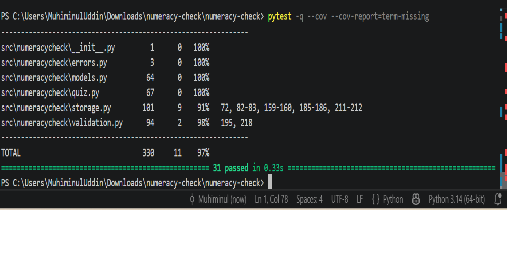

Coverage means how much of the code the tests can actually run.

To prove the tests really do fail when behaviour changes, I moved the distinction boundary from 80 to 85 per cent and ran the grade tests again. The edge case failed at once, and I changed the file back after

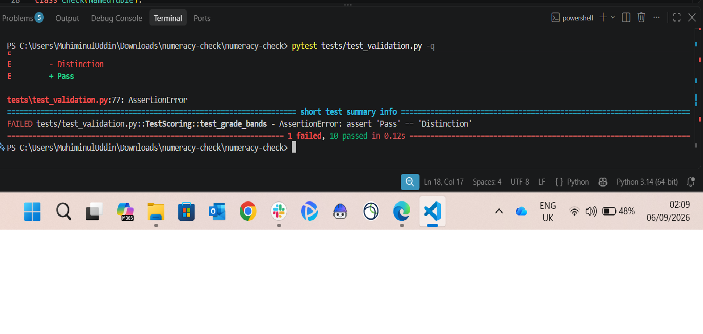

| Test file | Tests | What it covers |
| --- | --- | --- |
| `test_validation.py` | 11 | Names, fixing answers, marking, score bands, question row rules |
| `test_storage.py` | 9 | Missing file, skipped rows, filtering, picking, saving, export |
| `test_quiz.py` | 6 | Working through questions, rejected answers, scoring, timing |
| `test_models.py` | 5 | Building the right question type, marking, frozen classes, round trip |
| **Total** | **31** | |

The pull request below shows them passing before the change was merged into `main`.

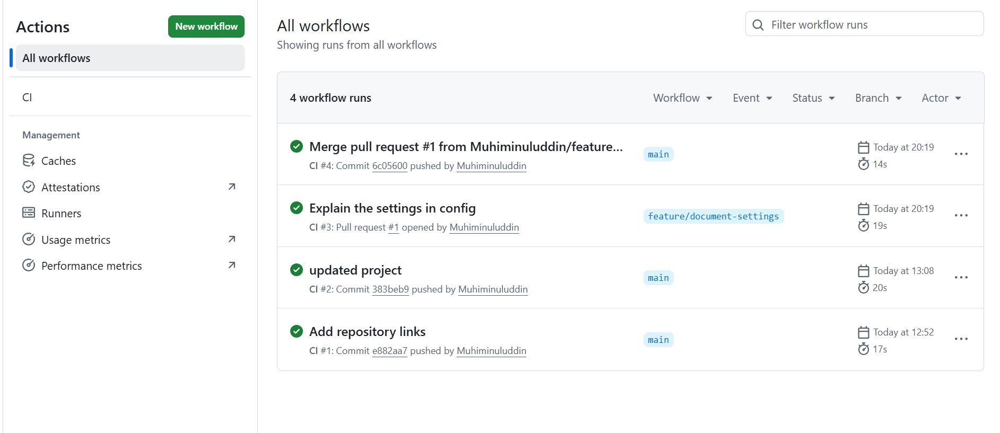

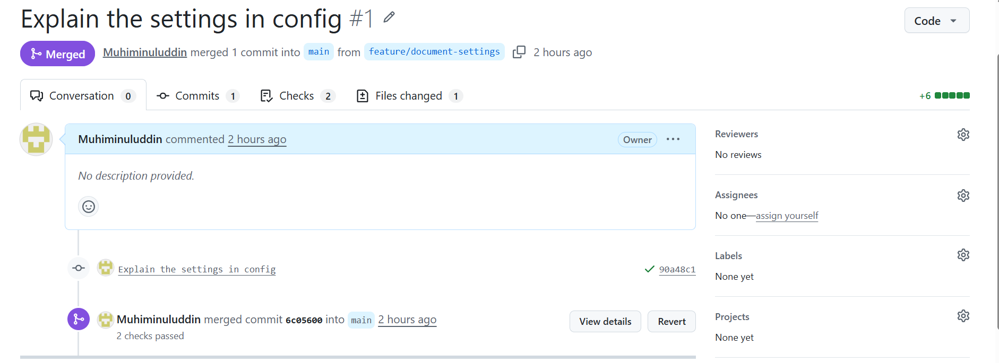

---

## 5. Documentation

### 5.1 User documentation

**Installing.**  Ask IT for Python 3.11 and double-click `run.bat` on Windows or `run.sh` on macOS. From a terminal:

```bash
PYTHONPATH=src python -m numeracycheck
```

**Taking a quiz.**

1. Type your name: letters, spaces, hyphens or apostrophes only.
2. Choose a topic, or leave **All categories** to mix them.
3. Choose between 3 and 20 questions, then press **Start quiz**.
4. Select an option or type your answer, then press **Submit answer** or **Enter**.
5. Read the feedback and press **Next question**. Answers cannot be changed.
6. After the last question you see your score, your band and a table of every question.

**Answer formats.** Type numbers only, such as `29`. Extra spaces and commas are ignored, so `1,009` works. Where an answer is written as a product, match the format shown, such as `2x2x3x5`.

**Outcome bands.**

| Score | Band | What it means |
| --- | --- | --- |
| 80% or above | Distinction | Confident across the topics tested |
| 60% to 79.9% | Pass | Competent, with specific gaps worth reviewing |
| Below 60% | Refer for support | Book a session with your team lead |

**Viewing and Exporting Results.** Click on **View past results** and click **Apply** to filter by Name or **Clear for all participants.** Export to CSV exports just the visible rows on the screen, so that way you can export one person's data without exporting everything.

**Adding Questions**. Edit `data/questions.csv` using Excel, and for each new question enter a new row. Keep the current structure but change `type` to either `multiple_choice` with pipe-separated values in options, or to `numeric` and leave the options field blank. Save and close, and start the program again. Incorrect entry will give an error pointing out which row was incorrect.

### 5.2 Technical documentation

**Setting up.**

```bash
git clone https://github.com/Muhiminuluddin/numeracy-check.git
cd numeracy-check
python -m venv .venv
source .venv/bin/activate      # Windows: .venv\Scripts\activate
pip install -r requirements-dev.txt
```

On Debian or Ubuntu, Tkinter is a separate package: `sudo apt install python3-tk`.

**Testing the program.** The first line executes everything; the rest are short-cuts.

```bash
pytest                                          # full suite
pytest --cov --cov-report=term-missing          # with coverage
pytest tests/test_validation.py -k grade        # one group of tests
ruff check .                                    # lint, including docstrings
```

**How it works.** The screens use the validation module, but the validation module never uses the screens. `validation.py` contains the pure functions, `models.py` contains `Question` and `Attempt` classes, `storage.py` contains all the file I/O, and `quiz.py` contains one attempt.

**Extend.**


- *New question class*: derive from `Question`, implement `check`, and add a branch to `Question.from_row`.
- *New outcome class*: adjust the threshold values in `validation.py`, and then update `TestScoring` in `test_validation.py`.
- *New storage system*: implement the same three methods as `ResultsStore`, and pass it to `QuizApp`.
- *New screen*: define a `ttk.Frame` subclass with an `on_show` method

**Releasing.** The merge process onto `main` runs the tests under Python 3.11 and 3.12. In order to bundle into a single file :

```bash
pip install pyinstaller
pyinstaller --onefile --windowed --name NumeracyCheck --add-data "data:data" src/numeracycheck/__main__.py
```


---

## 6. Evaluation

### What went well

The process of developing the rules simplified everything else. By the time I decided to open the window, the rules of names, marking, and grading were tested, so all that was left was to take whatever the user had typed in, apply the rule and display the result. This also meant that the tests could not include any screen, so the automatic testing became simple.

The division of the check and marking process proved to be useful beyond my expectation. The first version marked the empty answer as incorrect and during the testing I lost a point due to one click. With the separation of the checking and marking processes, the problem was fixed within ten minutes.

The submission of the clock and the random number generator proved to be a small but extremely useful step, because before I submitted them my question choosing tests sometimes failed, because of the appearance of the same question twice and my speed test required some speed of the machine.

The error handling considered the environment of the office rather than that of the book. The expected error is when `results.csv` is opened in Excel.

### What could have been improved

No part of the tool provides the feedback loop I outlined above. While attempts are stored with their topic (thus providing the data needed to find out "which topics do people struggle with?"), there is nothing summing it up. The manager has to filter by name, export the results to CSV, and analyse them in Excel. The topic summary would be the feature that would make the difference here.

I could have made my UI have automated tests as most of my twenty manual test cases possibly could have been automated and could have been run on the build server, detecting an interface regression automatically instead of doing it manually every time. Automating a desktop application's interface is tricky, and that is why it needs to be planned up front instead of avoided.

I would reconsider CSV files. While they were the right choice from the point of view of adoption – since everyone can open results in Excel – there is nothing stopping two people from saving changes simultaneously, which will result in silent corruption of the file while stored in a network location. SQLite ships with Python could have been used.

The question bank is an advantage and a disadvantage. Everybody can input new questions in Excel, but no one can input any questions from the app, and a single typo will become apparent at the next startup.

Also perhaps next time I would do something differently in the connection of the project with GitHub. The fact is that I set up the pipeline in the second commit, while working locally for the whole week so it ran checks only when the project was ready. If I had done it earlier then it would have helped me caught more bugs in the development stage.

If I proceeded with my plan, then after the topic breakdown on the result screen, the next step would be to create automated testing of the interface, and then to switch to SQLite.

---

## References

- [Python documentation: Tkinter](https://docs.python.org/3/library/tkinter.html)
- [Python documentation: `csv` module](https://docs.python.org/3/library/csv.html)
- [Python documentation: `dataclasses`](https://docs.python.org/3/library/dataclasses.html)
- [Python documentation: `abc` — abstract base classes](https://docs.python.org/3/library/abc.html)
- [PEP 257: Docstring conventions](https://peps.python.org/pep-0257/)
- [Google Python Style Guide: docstrings](https://google.github.io/styleguide/pyguide.html#38-comments-and-docstrings)
- [pytest documentation: parametrising tests](https://docs.pytest.org/en/stable/how-to/parametrize.html)
- [pytest documentation: `tmp_path` fixture](https://docs.pytest.org/en/stable/how-to/tmp_path.html)
- [pytest-cov documentation](https://pytest-cov.readthedocs.io/)
- [Ruff documentation](https://docs.astral.sh/ruff/)
- [GitHub Actions: workflow syntax](https://docs.github.com/en/actions/using-workflows/workflow-syntax-for-github-actions)
- [ISTQB Glossary: boundary value analysis](https://glossary.istqb.org/en_US/term/boundary-value-analysis)
- [PyInstaller documentation](https://pyinstaller.org/en/stable/)
